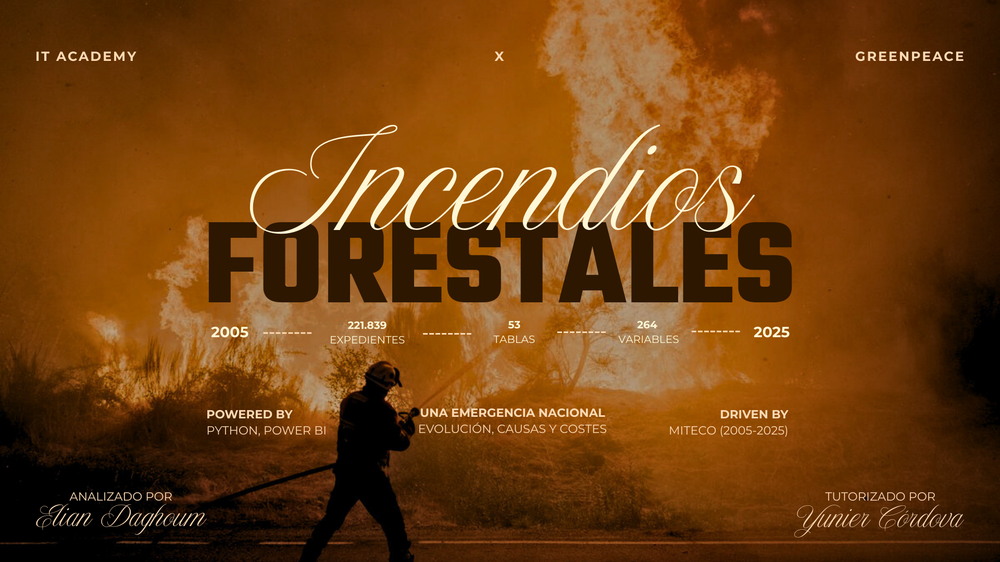
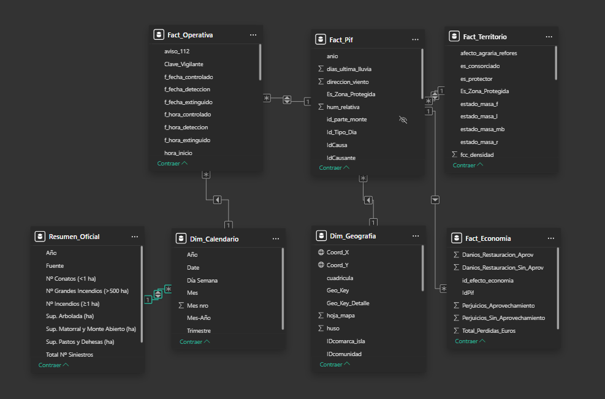

# 🔥 Incendios Forestales: Una Emergencia Nacional (2005-2025)

### 🚑 PROYECTO DE INTELIGENCIA DE DATOS EN COLABORACIÓN CON GREENPEACE
**Una auditoría técnica para apoyar la estrategia de defensa forestal de la ONG.**

    


> **"Un análisis End-to-End sobre la anatomía del desastre: Desde la extracción de datos ocultos en la administración pública hasta la visualización de 3.400 millones de euros en pérdidas."**



---

## 📥 Accesos Rápidos (Entregables)
Si quieres ir directo al grano, aquí tienes los documentos finales del proyecto:
* 📄 **[Ver Informe Ejecutivo (PDF)](04_deliverables/%20Informe_Incendios_Greenpeace.pdf)** - *El reporte presentado a cliente.*
* 📄 **[Ver Documentación Técnica (PDF)](04_deliverables/Documentacion_tecnica.pdf)** - *Metodología detallada.*
* 📓 **[Ver Diccionario de Datos](02_data_modeling/data_dictionary.md)** - *Explicación de las 53 tablas del modelo.*

---

## 📋 Resumen Ejecutivo
España se enfrenta a una paradoja operativa: **tenemos el mejor sistema de extinción de Europa, pero sufrimos los incendios más devastadores.**

Este proyecto no es solo un dashboard; es una investigación de ingeniería de datos que procesa **221.839 expedientes oficiales** para desmentir mitos. A través de un pipeline ETL propio, se ha estructurado la información histórica del Ministerio para la Transición Ecológica (MITECO) para demostrar que el problema no es solo el clima, sino la gestión del territorio (abandono rural y monocultivos).

## 🤝 Contexto del Cliente (Stakeholder)
Este proyecto nace de una colaboración con **Greenpeace España** para dar respuesta a preguntas críticas sobre la eficacia de la inversión pública en incendios.

* **El Reto:** La organización necesitaba evidenciar con datos duros que el modelo de extinción actual es insuficiente sin gestión forestal.
* **La Solución:** Un dashboard interactivo que permite a los técnicos de la ONG cruzar variables de propiedad, costes y biodiversidad para sus campañas de concienciación.

### 🎯 Las Grandes Cifras
* **Volumen:** 221.839 Siniestros analizados.
* **Complejidad:** Modelo en Estrella (Snowflake) con 53 tablas y 264 variables.
* **Impacto:** Análisis de pérdidas estimadas en **3.443 Millones de €** (2025).

---

## 🛠️ Arquitectura Técnica

### 1. Ingeniería de Datos (Python & Scraping)
El portal oficial EGIF presentaba limitaciones de acceso (archivos XML ocultos y paginación compleja). Se desarrolló una solución de **Ingeniería Inversa**:
* **Extracción (`01_ingestion_scripts/`):** Script en Python (`Selenium` + `Requests`) que inyecta parámetros en el DOM para forzar la descarga masiva de datos (~62MB por año).
* **Parsing:** Procesamiento iterativo (`ET.iterparse`) para transformar XMLs complejos anidados en DataFrames planos sin saturar la memoria.
* **Normalización:** Estandarización de IDs geográficos y meteorológicos de 20 años de histórico.

### 2. Modelado de Datos (Power BI)
Se diseñó un **Esquema en Copo de Nieve (Snowflake Schema)** centrado en la tabla de hechos `Fact_Pif` (Parte de Incendio Forestal), optimizando el rendimiento para filtrar un cuarto de millón de registros en tiempo real.



* **Facts:** `Fact_Operativa` (Tiempos), `Fact_Territorio` (Impacto ecológico), `Fact_Economia` (Costes).
* **Dimensions:** 49 tablas dimensionales normalizadas (Taxonomía, Causas, Geografía, Medios).
* **[👉 Ver el Diccionario de Datos completo aquí](02_data_modeling/data_dictionary.md)**

---

## 🚀 Insights Clave (Resultados del Análisis)

### 1. La Paradoja de la Extinción
Los datos revelan que somos víctimas de nuestro propio éxito. El sistema apaga el **98% de los conatos** (<1 ha) en tiempos récord (llegada media de brigadas: 29 min).
> *Conclusión:* Al eliminar el fuego pequeño, permitimos que la biomasa se acumule. Cuando un incendio escapa al control, encuentra un monte cargado de combustible, convirtiéndose en un Gran Incendio Forestal (GIF) imparable.

### 2. El Perfil del "Monstruo"
El análisis multivariable ha generado un "retrato robot" de los incendios más devastadores (Top 15):
* **Dónde:** Zonas No Protegidas (ZNP) con una densidad forestal crítica del 70%.
* **Quién:** El 57% de la superficie quemada es **Propiedad Privada** sin gestión.
* **Qué arde:** El *Eucalyptus globulus* (cultivo industrial) arde masivamente en zonas sin protección, mientras que el *Quercus* (Roble) actúa como freno natural.

*(Visualización de especies disponible en el Dashboard)*

### 3. La Factura Económica
Existe un desequilibrio estructural en la inversión pública:
* Se destinan **108 Millones € a Extinción** (reacción).
* Solo **26 Millones € a Prevención** (gestión).
* **Resultado:** Pérdidas anuales millonarias en valor ecológico y madera.

### 4. La Raíz Cultural (Causas)
Solo el **5%** de los incendios son naturales (rayos). El 55,7% de los grandes incendios son **Intencionados**, motivados principalmente por:
* Venganzas y conflictos sociales.
* Prácticas agrícolas y ganaderas tradicionales (quemas de pastos).

---

## 🔮 Roadmap & Next Steps (Fase 2)
Tras el cierre de la fase académica (MVP), el proyecto continúa en desarrollo activo junto al equipo de Greenpeace para su implementación real.

**Hitos en curso:**

* [ ] **Escalabilidad:** Migración del modelo local a Power BI Service / Azure para acceso multi-usuario en la ONG.
* [ ] **Granularidad:** Profundización del análisis a nivel municipal para las zonas de alto riesgo (ZNP).

---

## 📂 Estructura del Repositorio

```text
📁 Spain-Wildfires-Greenpeace-Analytics
│
├── 📂 01_ingestion_scripts/    # Scripts de extracción (Python/Selenium)
├── 📂 02_data_modeling/        # Modelo de datos, Diccionario y Esquema
├── 📂 03_dashboard/            # Archivo maestro (.pbix)
├── 📂 04_deliverables/         # Informes PDF para cliente
└── 📂 assets/                  # Imágenes y recursos gráficos
---
```
## 👤 Partner
* Greenpeace

## 👤 Autor

**Elian Daghoum**
* *Data Analyst & Visualization Expert*
* Proyecto tutorizado por: Yunier Cordova (IT Academy)
* **Contacto:** [Tu LinkedIn] | [Tu Email]

---
*Fuente de datos: Estadística General de Incendios Forestales (EGIF) - Ministerio para la Transición Ecológica (MITECO).*

*"Aviso: Este análisis ha sido realizado como proyecto final de Data Analytics en colaboración con Greenpeace. Las conclusiones y visualizaciones representan el análisis técnico del autor basado en datos oficiales y no necesariamente la postura oficial completa de la organización."*
](https://github.com/Elian-digital/Spain-Wildfires-Greenpeace-Analytics)
