# 🔥 Incendios Forestales en España: Una Emergencia Nacional (2005–2025)

> *Durante el tiempo que tardes en leer esto, arderán varias hectáreas de monte.*

Colaboración con **Greenpeace España** · IT Academy Barcelona · Python + Power BI · Datos MITECO

 

📄 [Ver Informe Ejecutivo (PDF)](04_deliverables/%20Informe_Incendios_Greenpeace.pdf) · 📄 [Documentación Técnica](04_deliverables/Documentacion_tecnica.pdf) · 📓 [Diccionario de Datos](02_data_modeling/data_dictionary.md)

---

## El encargo

Greenpeace España necesitaba evidenciar con datos duros que el modelo actual de gestión forestal es insuficiente. El problema: los datos históricos del Ministerio (MITECO) estaban enterrados en archivos XML sin API de descarga directa, dispersos en 20 años de registros.

Desarrollé un pipeline ETL completo con Python/Selenium para extraer **221.839 expedientes oficiales**, construí un modelo Snowflake de 53 tablas y 264 variables en Power BI, y entregué un dashboard + informe técnico que Greenpeace puede usar en sus campañas.

---

## La historia que cuentan los datos

### Lo bueno: vamos mejorando

La tendencia de los últimos 20 años es positiva. El número total de incendios desciende año tras año — de 7.328 en 2005 a ~2.600 en 2025. Las campañas de concienciación funcionan. Las brigadas llegan en **29 minutos de media**. El 98% de los conatos (incendios menores de 1 hectárea) se extinguen antes de crecer.

Somos muy buenos apagando fuegos pequeños.

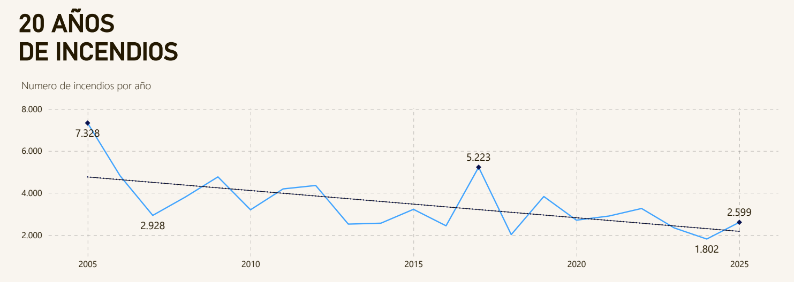

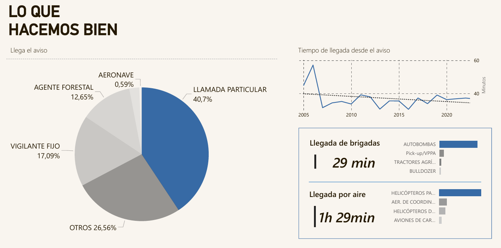

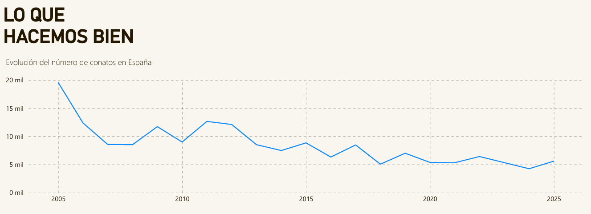

---

### El giro: el 95% no son accidentes

Solo un **5% de los incendios tienen causa natural** (rayo). El resto son provocados — intencionados, prácticas agrícolas y ganaderas, conflictos sociales. Y los intencionados no son solo los más frecuentes: son los más devastadores con diferencia.

**La intención es lo que cuenta.**

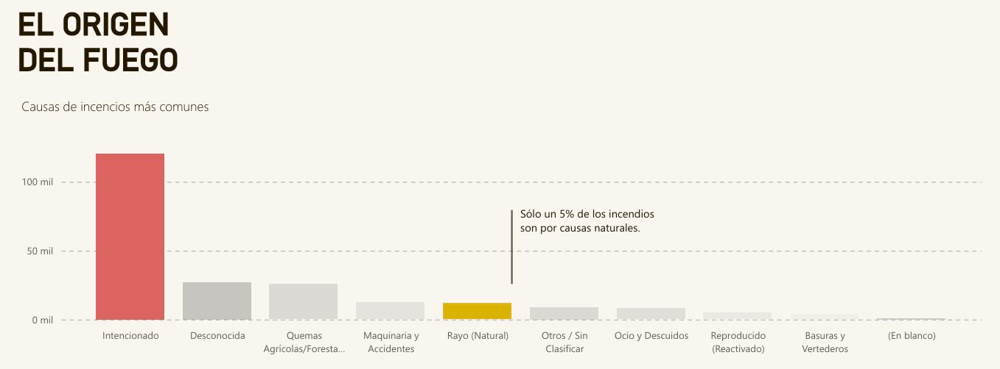

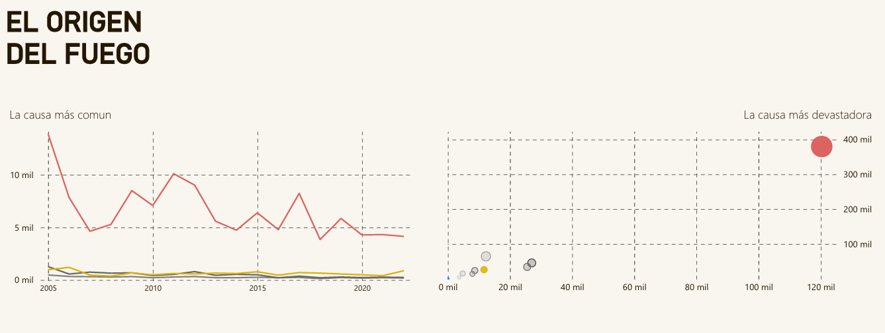

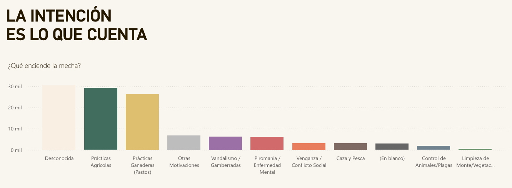

---

### Dónde ocurre: tres perfiles de provincia

No todas las provincias arden igual. El análisis geográfico revela tres patrones distintos de riesgo con implicaciones estratégicas diferentes para la distribución de recursos.

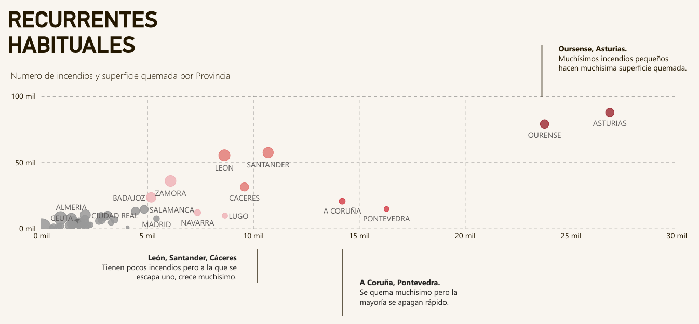

---

### El valor de lo que perdemos

El 66,5% de la superficie quemada no es arbolada — matorral, pastizal, monte bajo. La pérdida financiera de madera es cuantificable. La pérdida ecológica, no. Y los datos muestran que el **valor ecológico supera sistemáticamente las pérdidas comerciales**.

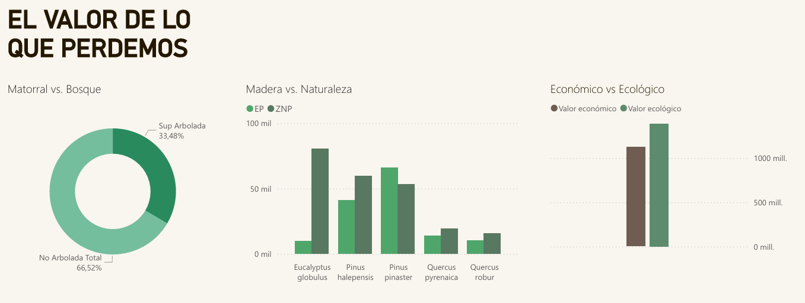

---

### Cuando no lo hacemos bien: el monstruo

Aquí está la paradoja: mientras los incendios pequeños bajan, los Grandes Incendios Forestales (+500 ha) van en aumento. Tenemos menos incendios que nunca, pero la superficie quemada se dispara.

Al extinguir eficientemente los fuegos pequeños, permitimos que la biomasa se acumule. Cuando un incendio escapa al control, encuentra un monte cargado de combustible. El resultado es un monstruo imparable.

**2025: 355.000 hectáreas quemadas. El peor año desde que hay registros.**

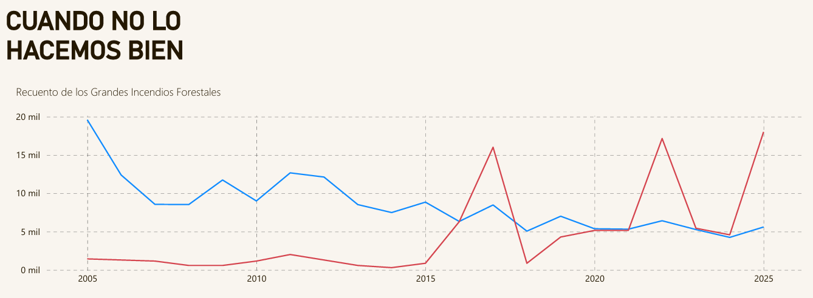

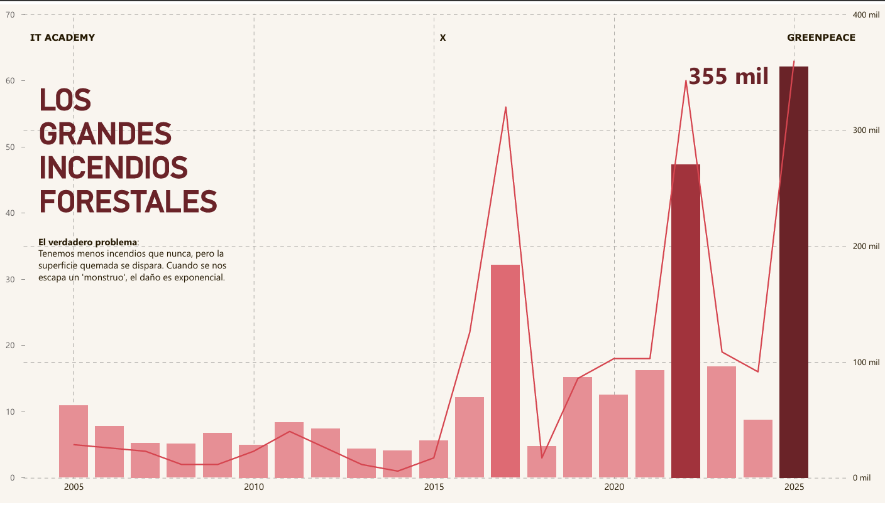

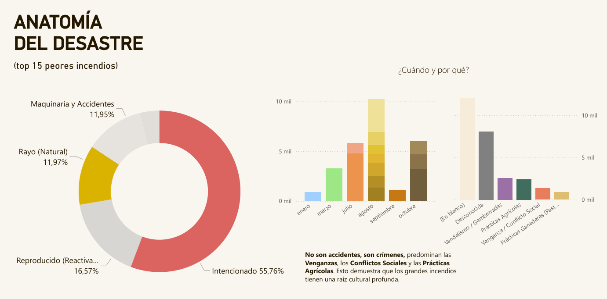

---

### Anatomía del desastre

El análisis multivariable de los **Top 15 peores incendios** revela un patrón claro:

- **Dónde arden:** Zonas No Protegidas (ZNP) con densidad forestal del 70%. El **57,8% es propiedad privada** sin gestión activa.
- **Por qué:** El 55,7% de los grandes incendios son **intencionados**. Las motivaciones dominantes: venganzas, conflictos sociales, prácticas ganaderas. No son accidentes, son crímenes con raíz cultural.
- **Qué arde:** El *Eucalyptus globulus* (cultivo industrial) arde masivamente en zonas sin protección. El *Quercus* actúa como freno natural.

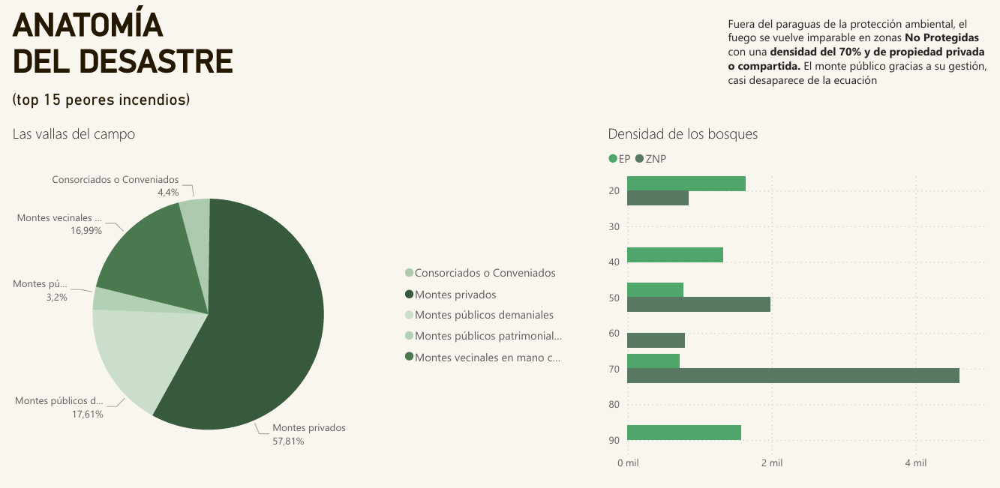

---

### La factura

| | |
|---|---|
| Pérdidas estimadas 2025 | **3.443 millones €** |
| Coste medio por hectárea | 9.705 € |
| Inversión en extinción | 108 M€ |
| Inversión en prevención | 26 M€ |

El desequilibrio es estructural: gastamos 4 veces más en apagar que en evitar. Y aun así, cuando el monstruo aparece, no podemos con él.

---

## Arquitectura técnica

### Ingeniería de Datos (Python)
El portal EGIF no tiene API. Los datos están en XMLs paginados con acceso restringido. Desarrollé ingeniería inversa con **Selenium + Requests** para inyectar parámetros en el DOM y forzar la descarga masiva (~62MB por año durante 20 años).

- **Parsing:** `ET.iterparse` para procesar XMLs anidados sin saturar memoria
- **Normalización:** estandarización de IDs geográficos y meteorológicos a lo largo de 20 años de histórico

### Modelado en Power BI (Snowflake Schema)
Modelo centrado en `Fact_Pif` (Parte de Incendio Forestal), optimizado para filtrar 221K registros en tiempo real.

- **Facts:** `Fact_Operativa` (tiempos), `Fact_Territorio` (impacto ecológico), `Fact_Economia` (costes)
- **Dimensions:** 49 tablas normalizadas (taxonomía, causas, geografía, medios)

---

## Estructura del repositorio
